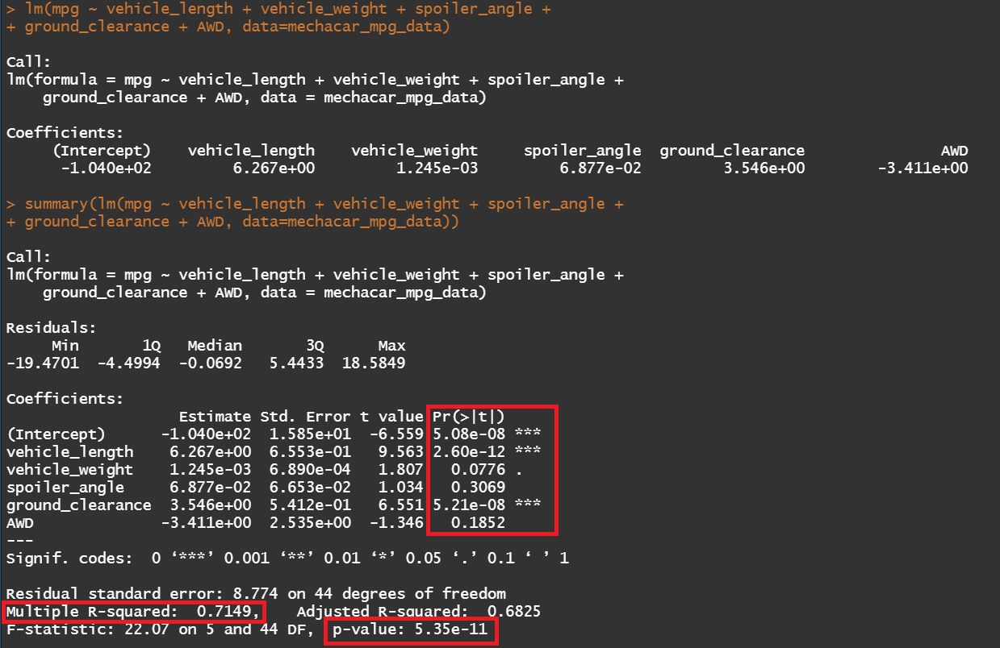
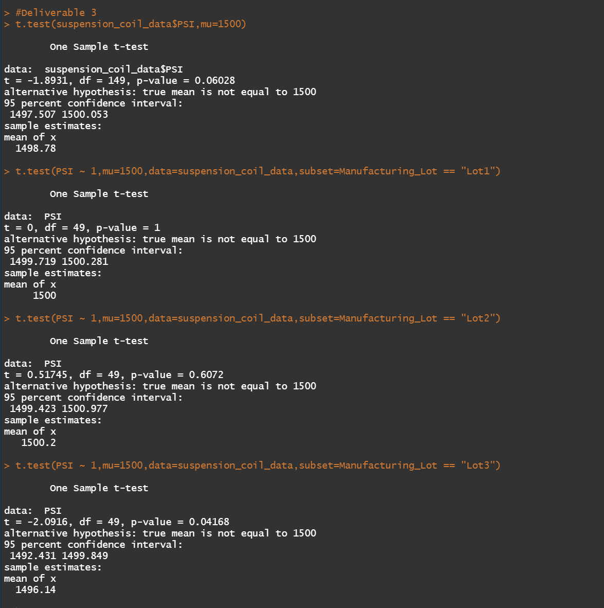

# **MechaCar Statistical Analysis**

## **Overview**
AutosRUs, an automotive manufacturer, had developed a new prototype, the MechaCar. The MechaCar is suffering from production troubles that are blocking the manufacturing team’s progress. AutosRUs’ upper management has requested that a data analysis be performed that reviews the production data for insights that may help the manufacturing team.

 

## **Linear Regression to Predict MPG**

Q. Which variables/coefficients provided a non-random amount of variance to the mpg values in the dataset?
 
A. Each Pr(>|t|) value represents the probability that each coefficient contributes a random amount of variance to the linear model. Based on the results, the intercept, vehicle_length, and ground_clearance have a significant impact on mpg.

 

Q. Is the slope of the linear model considered to be zero? Why or why not?
 
A. The P-value of the model is 5.35 x 10-11 which is much smaller than our assumed significance level of 0.05%. Therefore, there is sufficient evidence to reject our null hypothesis, which means that the slope of our linear model is not zero.

 

Q. Does this linear model predict mpg of MechaCar prototypes effectively? Why or why not?
 
A. This linear model does not predict mpg effectively. From our linear regression model, the r-squared value is 0.72, which means that roughly 72% of the variablilty of our dependent variable (mpg predictions) is explained using this linear model. However, as there are three variables that are not considered significant this means that there is overfitting in the model. Overfitting means that the performance of a model performs well with a current dataset, but may fail to generalize and predict future data correctly.

 

    
    Figure 1 (Linear Regression Results)

 

## **Summary Statistics on Suspension Coils**
Q. The design specifications for the MechaCar suspension coils dictate that the variance of the suspension coils must not exceed 100 pounds per square inch. Does the current manufacturing data meet this design specification for all manufacturing lots in total and each lot individually? Why or why not?
 
A. Based on the summary statistics (See Figures 2-3), when the statistics are generated for all manufacturing lots together the variance is within the specification. However, when the statistics are broken down by manufacturing lot, Lot3 fails to meet the variance specification since Lot3 has more PSI measurements that are farther from the mean. All other lots are within specification. 

 

     
    Figure 2 (PSI Summary Statistics - All Lots)

 

     
    Figure 3 (PSI Summary Statistics - By Lot)

 

## **T-Tests on Suspension Coils**
Four one-sample t-test were performed (See Figure 4) to determine if the PSI across all manufacturing lots is statistically different from the population mean of 1,500 pounds per square inch and if the PSI for each manufacturing lot is statistically different from the population mean of 1,500 pounds per square inch. Assuming our significance level was the common 0.05 percent, the tests yielded the following results:

- Is the PSI across all manufacturing lots statistically different from the population mean of 1,500 pounds per square inch?
    - The resulting p-value is 0.06028, therefore, there is not sufficient evidence to reject the null hypothesis, and thus the two means are statistically similar.
- Is the PSI for LOT1 statistically different from the population mean of 1,500 pounds per square inch?
    - The resulting p-value is 1, therefore, there is not sufficient evidence to reject the null hypothesis, and thus the two means are statistically similar.
- Is the PSI for LOT2 statistically different from the population mean of 1,500 pounds per square inch?
    - The resulting p-value is 0.6072, therefore, there is not sufficient evidence to reject the null hypothesis, and thus the two means are statistically similar.
- Is the PSI for LOT3 statistically different from the population mean of 1,500 pounds per square inch?
    - The resulting p-value is 0.04168, therefore, there is sufficient evidence to reject the null hypothesis, and thus the two means are not statistically similar.

 

     
    Figure 4 (PSI One-Sample T-Tests)

 

## **Study Design: MechaCar vs Competition**
To quanity how the MechaCar performs against the compeition we can perform a statistical study on highway fuel efficiency (Highway MPG) between MechaCar and a competitor. Our hypotheses would be:
- H0 = The difference in fuel efficiency between the MechaCar and a competitor is equal to zero.
- Ha = The difference in fuel efficiency between the MechaCar and a competitor is not equal to zero.

To peform this analysis we would need to utilize a pair t-test since we would be comparing two samples, each from a different population. The data that would need to be collected would be the vehicle manufacturer, vehicle class (optional) for futher analysis, and the highway fuel efficiency.
